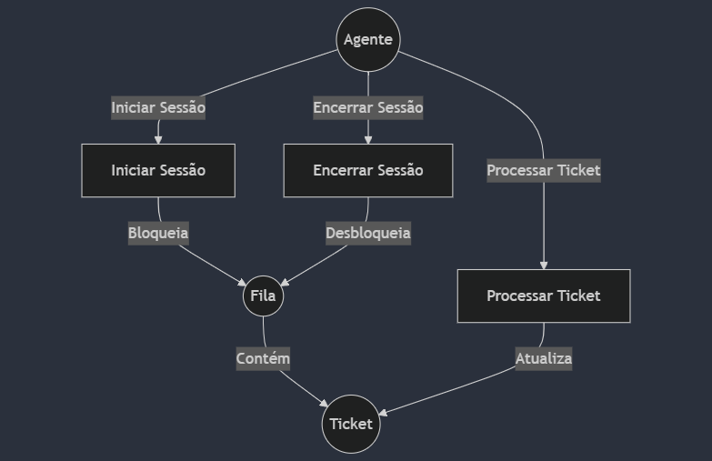
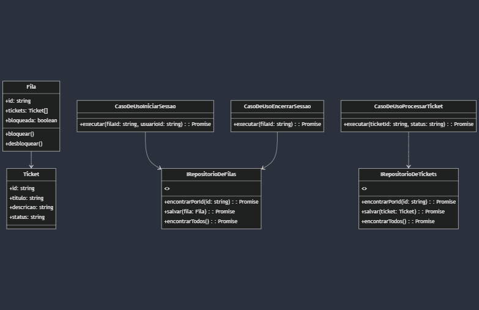

# Week IT Tickets - Sistema de Suporte a Tickets
## Índice
1. [Introdução](#introdução)
2. [Arquitetura](#arquitetura)
3. [Casos de Uso](#casos-de-uso)
4. [Estrutura do Projeto](#estrutura-do-projeto)
5. [Padrões de Design e Metodologias](#padrões-de-design-e-metodologias)
6. [Configuração e Instalação](#configuração-e-instalação)
7. [Executando a Aplicação](#executando-a-aplicação)
8. [Executando Testes](#executando-testes)
9. [Endpoints da API](#endpoints-da-api)
10. [Diagramas](#diagramas)

## Introdução
O Sistema de Suporte a Tickets é uma aplicação Node.js construída com TypeScript que gerencia tickets de suporte e filas. Demonstra princípios de arquitetura limpa, design orientado a domínio e desenvolvimento orientado a testes.

## Arquitetura
Este projeto segue o padrão de Arquitetura Limpa, com clara separação de responsabilidades:

1. Camada de Domínio: Contém entidades e interfaces que definem a lógica de negócios principal.
2. Camada de Aplicação: Implementa casos de uso que orquestram o fluxo de dados e regras de negócios.
3. Camada de Infraestrutura: Fornece implementações concretas de repositórios e serviços.
4. Camada de Apresentação: Lida com requisições e respostas HTTP (implementada como uma API REST).

## Casos de Uso
1. Iniciar Sessão: Permite que um agente comece a trabalhar em uma fila de tickets.
2. Encerrar Sessão: Permite que um agente termine de trabalhar em uma fila.
3. Processar Ticket: Permite que um agente aprove ou rejeite um ticket.

## Estrutura do Projeto
```
src/
├── domain/
│   ├── entities/
│   └── interfaces/
├── application/
│   ├── services/
│   └── usecases/
├── infrastructure/
│   ├── repositories/
│   └── web/
│       ├── controllers/
│       └── routes/
└── server.ts
tests/
├── domain/
├── application/
└── infrastructure/
```

## Padrões de Design e Metodologias
- Design Orientado a Domínio (DDD): Usado para modelar a lógica de negócios principal.
- Desenvolvimento Orientado a Testes (TDD): Todos os componentes são desenvolvidos seguindo a abordagem TDD.
- Padrão de Repositório: Usado para abstração de acesso a dados.
- Injeção de Dependência: Usada para acoplamento frouxo entre componentes.
- Princípios SOLID: Seguidos em todo o design do projeto.

## Configuração e Instalação
1. Clone o repositório:
    ```
    git clone https://github.com/thallyslemos/tickets-week-it.git
    cd tickets-week-it
    ```
2. Instale as dependências:
    ```
    npm install
    ```

## Executando a Aplicação
1. Compile o código TypeScript:
    ```
    npm run build
    ```
2. Inicie o servidor:
    ```
    npm start
    ```
O servidor será iniciado em `http://localhost:3000`.

## Executando Testes
Execute o seguinte comando para rodar todos os testes:
```
npm test
```

## Endpoints da API
- POST /api/sessions/start - Iniciar uma nova sessão
- POST /api/sessions/end - Encerrar uma sessão existente
- POST /api/tickets/:ticketId/process - Processar um ticket

## Diagramas

### Diagrama de Casos de Uso
<!-- anexa imagem aqui -->


### Diagrama de Classes
